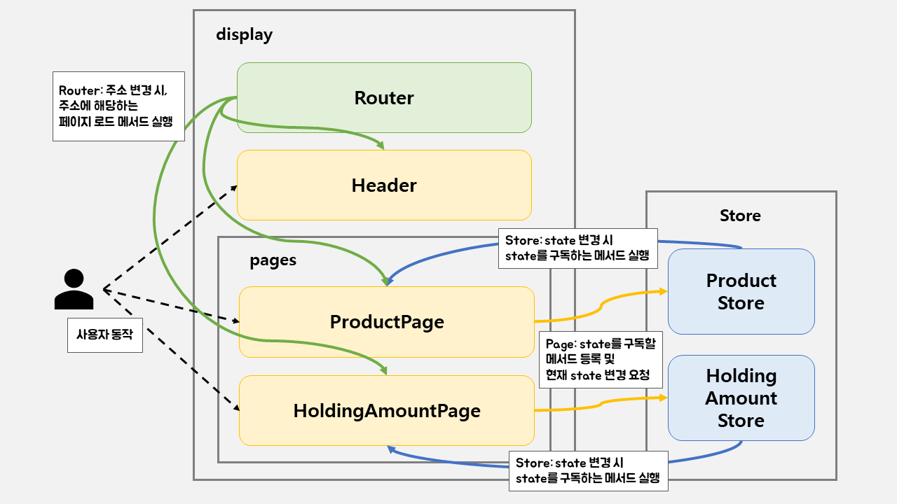
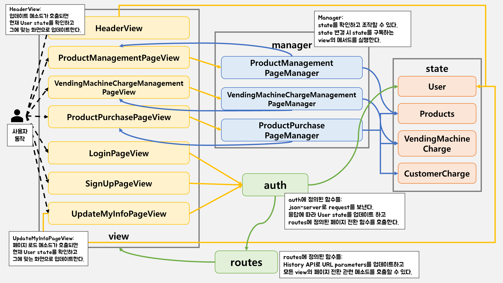

<p align="middle" >
  
</p>
<h2 align="middle">level1 - 자판기</h2>
<p align="middle">자바스크립트로 구현 하는 자판기 어플리케이션</p>
<p align="middle">
  
  
  
  
  
</p>

<br >

## [🥤 자판기 데모 페이지](https://soyi47.github.io/javascript-vendingmachine/)

<br >

## 기능 목록

### 도메인 영역

- 상품 관리
  - [x] 자판기는 상품 목록을 가질 수 있다.
  - [x] 자판기는 상품을 추가할 수 있다.
  - [x] 자판기는 상품을 수정할 수 있다.
  - [x] 자판기는 상품을 삭제할 수 있다.
  - [ ] 자판기는 선택된 상품 개수를 차감할 수 있다.
- 자판기가 보유한 동전
  - [x] 동전의 갯수 목록을 가질 수 있다.
  - [x] 충전 금액이 입력되면 해당 금액만큼 무작위로 동전이 추가된다.
  - [x] 현재 가지고 있는 총 금액을 계산할 수 있다.


### UI 영역

- 라우팅 기능
  - [x] 브라우저의 URL에 따라 페이지의 컨텐츠를 바꾸어 주어야 한다.

- 비회원 UI
  - [x] 상품 구매 페이지와 로그인 버튼만 볼 수 있다.
  - [x] 상단 로그인 버튼을 통해 로그인 페이지로 이동할 수 있다.

- 회원(관리자) UI
  - [x] 메뉴 버튼을 통해 상품 관리, 잔돈 충전, 상품 구매 페이지로 이동할 수 있다.
  - 상단 사용자 썸네일 버튼을 통해, 
    - [x] 회원 정보 수정 페이지로 이동할 수 있다.
    - [x] 로그아웃 할 수 있다.

- 상품 관리 페이지
  - [x] 사용자가 상품명, 가격, 수량을 입력하고 추가를 시도할 수 있다.
    - **예외처리**
    - [x] 상품명은 최대 10글자까지 가능하다.
    - [x] 상품 가격은 최소 100원, 최대 10,000원까지 가능하다.
    - [x] 상품 가격은 10원으로 나누어 떨어져야 한다.
    - [x] 한 제품당 수량은 최소 1개, 최대 20개까지 가능하다.
    - [x] 이미 존재하는 상품이라면, 사용자에게 `confirm`을 활용하여 사용자에게 재확인을 받고, 가격과 수량을 덮어씌워준다.
  - [x] 자판기가 보유 중인 상품 현황을 확인할 수 있어야 한다.
  - [x] 상품 현황의 수정 버튼을 클릭하여 상품명, 가격, 수량을 변경을 시도할 수 있다.
    - [x] 수정 시 상품평, 가격, 수량 정보 영역 자체가 input 영역으로 변경된다.
    - [x] 삭제 시 `confirm`을 활용하여 사용자에게 재확인한다.

- 잔돈 충전 페이지
  - [x] 사용자가 자판기 충전 금액을 입력하고 충전을 시도할 수 있다.
    - 잔돈을 충전하면 충전 금액만큼의 동전이 무작위로 충전된다.
    - 자판기의 보유 금액은 누적하여 충전할 수 있다.
    - **예외처리**
      - 충전 금액은 숫자만 입력할 수 있다.
      - 충전 금액은 10원 단위여야한다.
      - 자판기가 보유할 수 있는 최대 금액은 100,000원이다.
  - [x] 자판기가 보유 중인 동전 갯수를 확인할 수 있어야 한다.
  - [x] 자판기가 보유 중인 총 금액을 확인할 수 있어야 한다.

- 상품 구매 페이지
  - [x] 사용자가 상품 구매를 위한 금액 투입을 시도할 수 있다.
    - 상품 구매를 위한 금액은 누적하여 투입할 수 있다.
    - 금액 투입이 정상적으로 동작하거나 실패하였음을 `snackbar`를 통해 보여준다.
    - **예외처리**
      - 투입 금액은 숫자만 입력할 수 있다.
      - 투입 금액은 10원 단위여야한다.
      - 투입 금액은 최대 10,000원이다.
  - [x] 사용자는 누적된 투입 금액을 확인할 수 있다.
      - 페이지의 최초 충전 금액은 0원이다.

  - [x] 사용자는 반환하기 버튼을 눌러 잔돈을 반환받을 수 있다.
    - 잔돈은 최소 개수의 동전으로 돌려준다.
    - 잔돈 반환이 정상적으로 동작하거나 실패하였음을 `snackbar`를 통해 보여준다.
    - **예외처리**
      - 잔돈을 반환할 수 없는 경우, 반환할 수 있는 금액만 반환한다.
  - [x] 사용자는 반환된 각 동전의 개수를 확인할 수 있다.
    - 페이지의 최초 충전 반환된 각 동전의 개수는 0개다.

- 로그인 페이지
  - [x] 이메일, 비밀번호를 입력한 후 로그인을 시도할 수 있다.

- 회원가입 페이지
  - [x] 이메일, 이름, 비밀번호, 비밀번호 확인을 입력한 후 회원가입을 시도할 수 있다.
    - **예외처리**
      - [x] name은 2~6글자까지 가능하다.
      - [x] 비밀번호 password는 숫자, 소문자 알파벳, 대문자 알파벳 각각 1자 이상을 포함하여 전체 8자 이상이어야 한다.


- 회원 정보 수정 페이지
  - [x] 이름, 비밀번호, 비밀번호 확인을 입력하여 정보 수정을 시도할 수 있다.
    - 이메일은 수정할 수 없다.
    - **예외처리**
      - [x] 이름 name은 2~6글자까지 가능하다.
      - [x] 비밀번호 password는 숫자, 소문자 알파벳, 대문자 알파벳 각각 1자 이상을 포함하여 전체 8자 이상이어야 한다.

<br >

---

## 개요도

### Step 1



<br >

### Step 2



<br >

---

## ⚙️ Before Started

#### 개발 환경 가이드

개발 중에는 아래 명령어를 사용하여 webpack dev server를 띄워 현재 개발 중인 어플리케이션을 확인할 수 있습니다.

```
npm run start
```

별도로 빌드를 해야 한다면 아래 명령어를 사용해주세요

```
npm run build
```

<br>

## 👏 Contributing

만약 미션 수행 중에 개선사항이 보인다면, 언제든 자유롭게 PR을 보내주세요.

<br>

## 🐞 Bug Report

버그를 발견한다면, [Issues](https://github.com/woowacourse/javascript-vendingmachine/issues)에 등록해주세요.

<br>

## 📝 License

This project is [MIT](https://github.com/woowacourse/javascript-vendingmachine/blob/main/LICENSE) licensed.
